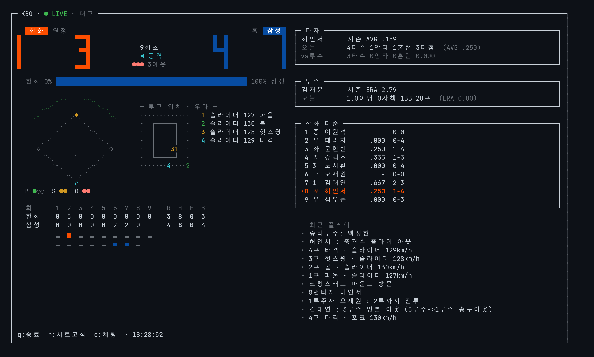
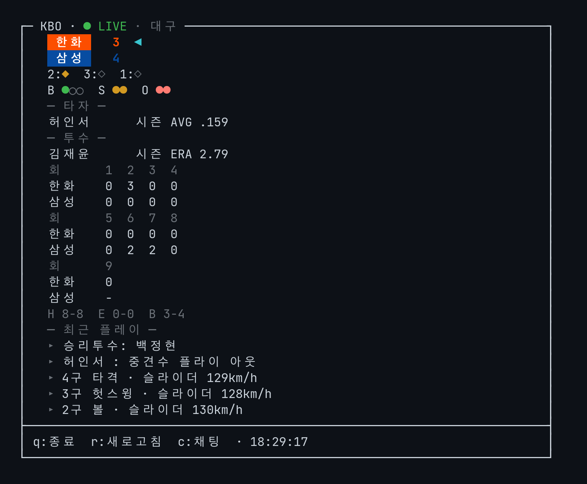

# kbo-cli

터미널에서 KBO 경기를 관전하는 TUI CLI. 점수 · 이닝 · 카운트 · 주자 · 투구 ·
최근 플레이를 ANSI 그래픽으로 그리고, `watch` 모드에서 한 화면에서 갱신된다.



## 설치

```bash
# 일회 실행
npx kbo-cli watch

# 전역 설치
npm i -g kbo-cli
kbo watch
```

요구사항: Node ≥ 18. 설치 후엔 `kbo update` 로 최신 버전을 받는다.

## 사용

```bash
kbo                            # 기본 명령 (kbo config 에서 지정), 미설정이면 도움말
kbo today                      # 오늘 경기 목록 (--date 2026-05-01)
kbo watch                      # 진행중 경기 라이브 (자동 선택)
kbo watch --team LG            # 팀으로 선택
kbo watch --game <gameId>      # 게임 ID 로 선택
kbo status [--team LG]         # 한 줄 요약 후 즉시 종료 (statusline 용)
kbo stats                      # 팀 순위 (인터랙티브 정렬)
kbo stats batting|pitching     # 타자/투수 리더보드
kbo config                     # 즐겨찾기 팀 · 폴링 간격 · 기본 명령 · 레이아웃
kbo update                     # 최신 버전으로 업데이트
```

주요 옵션: `--interval <sec>` 폴링 주기(기본 5), `--layout auto|compact|normal|wide`,
`--nick <이름>` watch 채팅 닉네임, `--debug` raw 응답 덤프.

레이아웃은 터미널 폭에 맞춰 자동 전환된다 — 80컬럼 미만 compact,
120컬럼 이상 wide(좌우 2단). `--layout` 이나 `kbo config` 로 강제할 수 있다.



### 화면 키

| 키          | 동작                                                                 |
| ----------- | -------------------------------------------------------------------- |
| `q`         | 종료                                                                  |
| `r`         | 즉시 새로고침                                                          |
| `c`         | watch: 채팅 열기 — 같은 경기 시청자 오픈 채팅 (Enter 전송, Esc 닫기)      |
| `←` `→`     | watch: 진행중 경기 전환 · stats: 정렬/카테고리 전환 · config: 값 변경    |
| `↑` `↓`     | watch: 중계 스크롤백 · stats: 뷰/행 이동 · config: 항목 이동            |
| `h` `l`     | stats: 컬럼 가로 스크롤 (◂/▸ 표시 시)                                  |
| `t`         | stats 리더보드: 팀 필터 순환                                           |
| `s` `Enter` | config: 저장 후 종료                                                   |

환경 변수: `KBO_NO_UPDATE_CHECK=1` 업데이트 체크 끔, `KBO_NO_HINT=1` 온보딩 힌트 끔.

## statusline 통합

`kbo status` 는 한 줄 ANSI 출력만 찍고 종료해 tmux/starship/Sketchybar 등에
끼워넣을 수 있다. 응답은 `~/.cache/kbo-cli/` 에 30초 캐시되어 5초마다 호출해도
실제 API 는 30초당 1회 이하로만 나간다.

```bash
kbo status --team LG     # LG 4 - 2 NC · 7회말 1사 1·3루 · 타: 오스틴
kbo status               # --team 생략 시 즐겨찾기 팀
```

종료 코드로 상태를 분기할 수 있다 — `0` 라이브/시작 전, `2` 오늘 경기 없음,
`3` 종료, `1` 에러.

```tmux
set -g status-right "#(kbo status --team LG)"
set -g status-interval 5
```

팀명은 `LG` `두산` `KIA` `KT` `삼성` `한화` `SSG` `롯데` `NC` `키움` 표기를 쓴다.

## 개발

```bash
git clone https://github.com/jeonbyeongmin/kbo-cli
cd kbo-cli
bun install
bun run dev watch                        # = bun run src/index.ts
bun run build                            # → dist/kbo.js (단일 파일)
```

요구사항: Bun ≥ 1.0. 런타임 의존성은 `picocolors` 하나다.

라이브 경기가 없을 땐 fixture 로 렌더를 확인한다:

```bash
bun run snapshot <gameId>                # 현재 응답을 fixtures/ 에 캡처
bun run render:fixture [<path>]          # 한 프레임 stdout 렌더
bun run watch:fixture                    # watch TUI 루프를 fixture 로 구동
```

## 데이터 소스

Naver Sports 비공식 게이트웨이 (`api-gw.sports.naver.com`):

- 일정: `/schedule/games?upperCategoryId=kbaseball&fromDate=…&toDate=…`
- 라이브: `/schedule/games/{gameId}/relay`
- 순위/리더보드: `/statistics/categories/kbo/seasons/{seasonCode}/…`

비공식이라 무공지 변경 위험이 있다. 응답 구조가 깨지면 `--debug` 로 raw JSON 을
덤프해 비교한다.

## 면책 / Disclaimer

이 프로젝트는 **팬메이드 비공식 도구**이며 KBO, 각 구단, 네이버, 통신사
어디와도 무관합니다.

- 비공식 게이트웨이를 조회하므로 사전 공지 없이 동작이 멈출 수 있습니다.
- **개인 학습/관전 용도로만 사용하세요.** 상업적 사용, 데이터 대량 수집,
  2차 서비스 구축은 권장하지 않습니다.
- 표시되는 텍스트 중계 문장은 원 출처(네이버/통신사)의 저작물이며 본 도구는
  단순 표시만 합니다.
- 폴링은 기본 5초(하한 1초)로 모바일 앱 수준의 호출 빈도를 유지합니다.
  `--interval` 을 무리하게 낮추지 말아 주세요.
- 권리자 측의 takedown 요청에는 즉시 응합니다. 이슈로 알려주세요.

## 라이선스

[MIT](./LICENSE)
